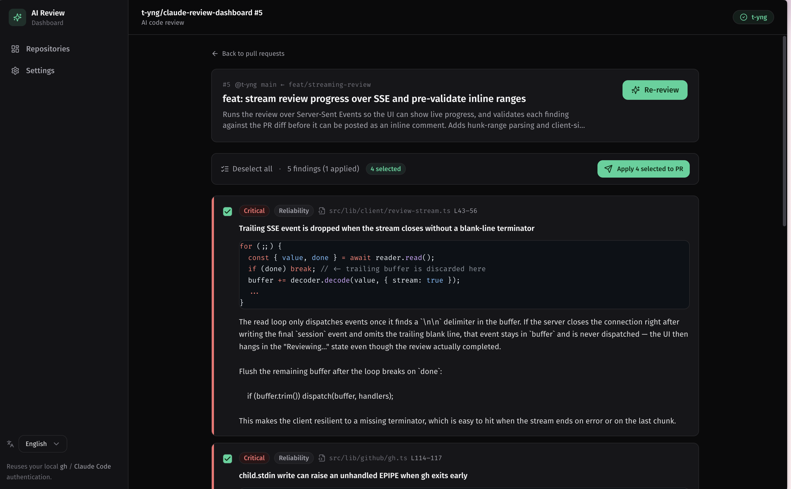

# Claude Review Dashboard

A local **desktop app** (Electron) that lets **Claude** review your GitHub Pull Requests, then lets a human **cherry-pick only the valuable findings** and post them back to the PR as inline review comments.

The reviewer (a senior engineer) runs it on their own machine and reuses their existing **Claude Code auth** and **`gh` CLI auth** as-is — no separate API key setup required.



## The problem I wanted to solve

AI-driven code review sometimes leaves inappropriate or misleading comments. Junior engineers often lack the experience to judge whether a given finding is actually valid, so in the end a review by an experienced engineer is still required.

At the same time, AI-assisted coding has dramatically increased development speed, and manually reviewing everything by hand has become extremely time-consuming.

What I wanted was a solution that lets me **adopt AI code review semi-automatically while a human picks out only the useful findings** and iterate on that loop quickly. Claude Review Dashboard is built to optimize exactly this cycle: **let the Claude Review → let a human curate → apply the good ones back to the PR.**

## Features

- 🔍 Browse GitHub repositories / open PRs with search and filtering
- ✨ One-click AI (Claude) review of a PR that produces structured findings
- 🎯 List findings with their target code and select/deselect them via checkboxes
- 💬 Batch-post only the selected findings as GitHub inline review comments
- ⚙️ Freely tune the review criteria (prompt) and model locally
- 🌙 A clean, stylish dark-themed dashboard (with i18n via `use-intl`)

## Technical highlights

- **Reuses local Claude Code auth, not raw API keys** — reviews run through `@anthropic-ai/claude-agent-sdk` with the `claude_code` system-prompt preset, so the app inherits the user's existing Claude Code session instead of managing credentials itself.
- **Agentic review over the real repo** — each run clones and checks out the PR into a temporary directory (`gh repo clone --depth 50` + `gh pr checkout --detach`) and gives Claude read-only tools (`Read`, `Grep`, `Glob`, `Bash`) so it can explore the whole codebase for context, not just the diff. The temp dir is always cleaned up in a `finally` block.
- **Streaming progress over IPC** — checkout → generating → done/error phases run in the Electron main process and are streamed to the renderer over IPC so long-running reviews show live progress (with best-effort cancellation via `AbortController`).
- **Robust JSON extraction + schema validation** — LLM output is parsed with a bracket-balancing scanner that ignores brackets inside string literals (so nested ``` fences in a finding's body don't break parsing), then validated with **zod**. On failure it retries once with a JSON-only re-prompt, and always persists the raw AI output to a log for debugging.
- **Pre-submission diff-range validation** — the app parses the unified diff (`gh pr diff`) to know exactly which lines are commentable, and warns about findings that fall outside the diff before posting, avoiding GitHub API errors on inline comments.
- **No token persistence** — GitHub access goes through the `gh` CLI via `child_process`; tokens are fetched on demand and never stored.

## Prerequisites

| Requirement | How to check |
|-------------|--------------|
| Node.js 20+ | `node -v` |
| GitHub CLI (`gh`), authenticated | `gh auth status` (run `gh auth login` if needed) |
| Claude Code auth | The SDK automatically reuses your local `~/.claude` auth |

## Setup

```bash
npm install
npm run dev
```

`npm run dev` launches the Electron desktop app with hot reload (electron-vite).

### Build a distributable

```bash
npm run build      # bundle main / preload / renderer into out/
npm run dist       # package a macOS .dmg into release/ (unsigned)
npm run dist:dir   # package an unpacked .app into release/ (faster, for local testing)
```

## Usage

1. **Pick a repository** — select the repo to review on the top screen.
2. **Pick a PR** — choose a target from the list of open PRs.
3. **Run the review** — press "Run review"; the PR is checked out into a temp dir and the AI generates findings (progress is shown live).
4. **Curate** — check the findings you want (select-all / deselect-all available). Findings that fall outside the diff and can't be posted are flagged with a warning.
5. **Apply to the PR** — "Apply N selected to PR" batch-posts them as GitHub inline review comments.
6. **Settings** — edit and save the review prompt and model from "Settings" in the sidebar (applied to the next review).

## Where data is stored

- `~/.config/claude-review-dashboard/settings.json` — review prompt and model settings
- `~/.config/claude-review-dashboard/sessions/<id>.json` — review run history
- `~/.config/claude-review-dashboard/logs/` — raw AI output logs (for debugging)

## Architecture

The app follows the standard Electron process split:

- **Main process** (`electron/main`) — Node.js backend that runs the `gh` CLI, drives the Claude Agent SDK, checks out PRs, and reads/writes local config. All former Next.js API routes are now IPC handlers (`electron/main/ipc.ts`).
- **Preload** (`electron/preload`) — exposes a typed, minimal `window.api` bridge to the renderer via `contextBridge` (context isolation on).
- **Renderer** (`src/`) — a Vite + React single-page app (TanStack Router). The client `api` facade and review stream call `window.api` instead of `fetch`.

> Next.js was removed during the desktop migration: its API routes require a running server, which doesn't fit Electron. The framework-agnostic backend code under `src/lib` moved to the main process largely unchanged.

## Tech stack

- **Electron** + **electron-vite** / TypeScript
- **Vite** + **React** SPA with **TanStack Router**
- **Tailwind CSS** + shadcn/ui-style components / lucide-react
- **TanStack Query** (renderer data fetching)
- **use-intl** (i18n; the framework-agnostic core of next-intl)
- **@anthropic-ai/claude-agent-sdk** (runs reviews reusing Claude Code auth)
- **zod** (structured validation of AI output)
- **shiki** (syntax highlighting for code snippets)
- **electron-builder** (macOS `.dmg` / `.app` packaging)
- GitHub integration via the `gh` CLI through `child_process` (tokens fetched on demand, never stored)
